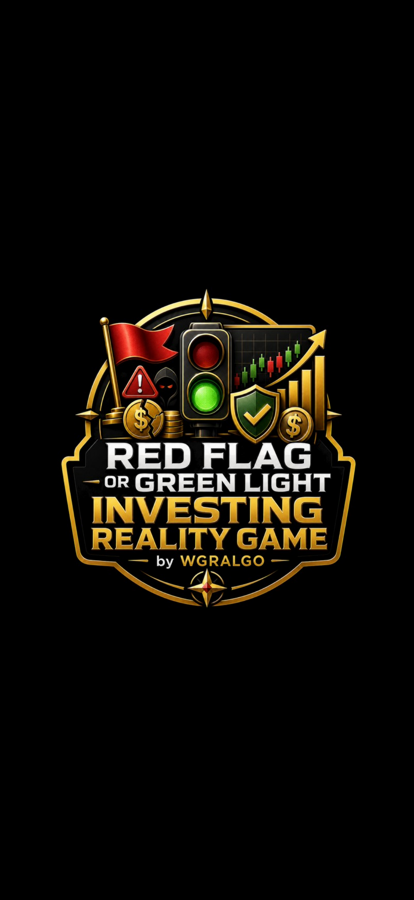
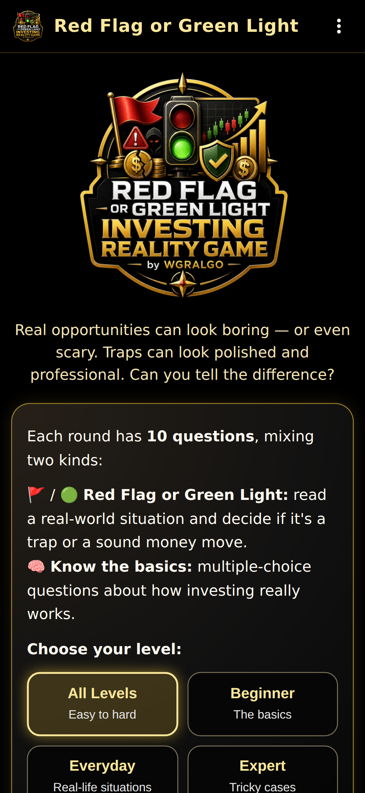
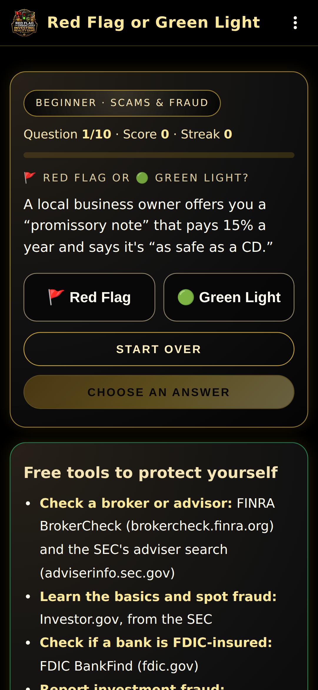
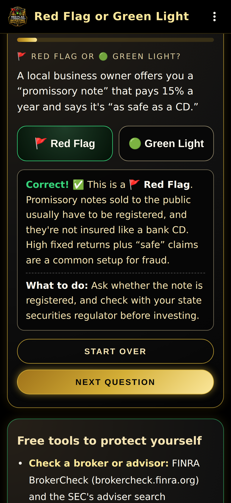
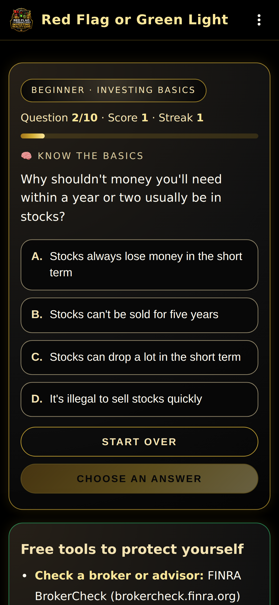
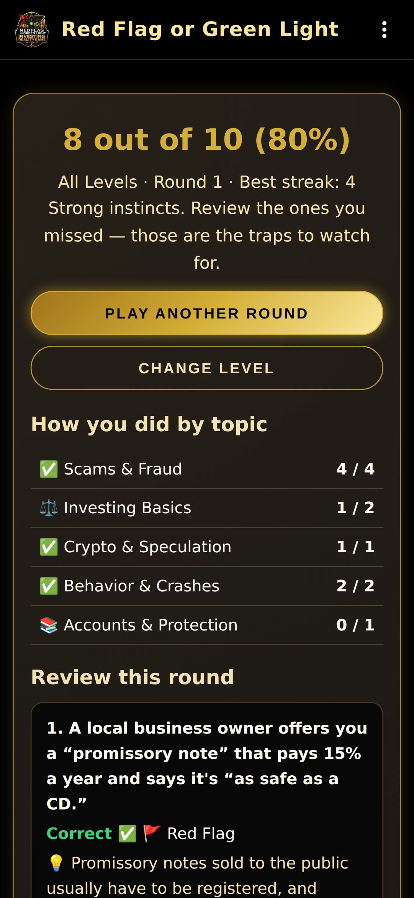
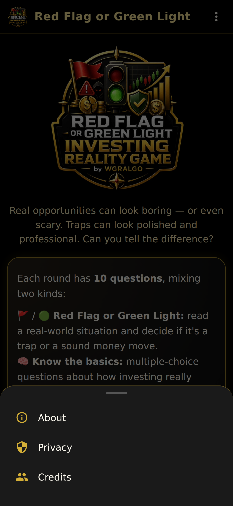
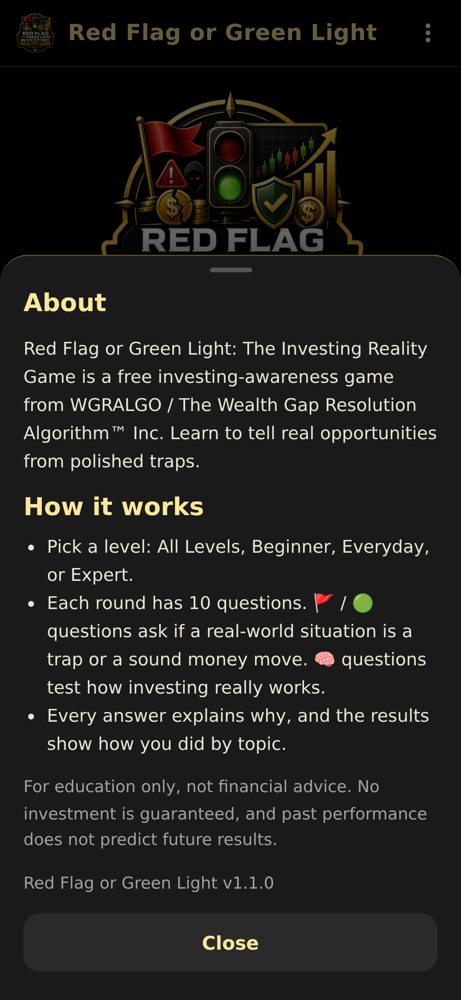

# WGRALGO Red Flag or Green Light: The Investing Reality Game

Red Flag or Green Light: The Investing Reality Game is a free educational Android app from The Wealth Gap Resolution Algorithm™ Inc. It helps users practice identifying real investing principles, risky money moves, hype, pressure tactics, and common investment red flags through interactive gameplay.

The app is fully offline, contains no ads, no analytics, no trackers, and asks for no permissions.

- **Version:** 1.1.0
- **Package:** `org.wgralgo.redflaggreenlightinvesting`
- **License:** GPL-3.0-only

---

## Features

- **81 built-in questions** across three levels: **Beginner** (the basics),
  **Everyday** (real-life situations), and **Expert** (tricky cases), plus an
  **All Levels** round that goes from easy to hard.
- Two kinds of questions in every round of 10:
  - 🚩 / 🟢 **Red Flag or Green Light:** read a real-world situation and decide
    if it's a trap or a sound money move, with a "What to do" tip for traps.
  - 🧠 **Know the basics:** multiple-choice questions about how investing really
    works, with myth busters for common wrong answers.
- Score, streak, and progress bar.
- Results with a breakdown by topic (Scams & Fraud, Investing Basics, Crypto &
  Speculation, Accounts & Protection, and more) and a full review of the round.
- A list of free tools to check brokers, learn the basics, and report fraud.
- **Looks like a real app:** black launch screen with the big logo, a new
  launcher icon, a solid app bar, About / Privacy / Credits panels, and
  Android back-button support (back asks before quitting a round, returns to
  the level picker from results, and asks before exiting the app).
- Fully offline: no internet permission, no network calls. No accounts, no
  ads, no analytics, no trackers.

## Screenshots

| Launch | Home | Red Flag or Green Light | Feedback |
|---|---|---|---|
|  |  |  |  |

| Know the basics | Results | Menu | About |
|---|---|---|---|
|  |  |  |  |

## How to install / sideload the APK

1. Download `RedFlagGreenLight-v1.1.0.apk` from the [GitHub Releases](../../releases) page.
2. On your Android device, allow installs from your browser or file manager (Settings → Apps → Special access → Install unknown apps).
3. Open the downloaded APK and tap **Install**.
4. Optional integrity check (Linux/macOS):
   ```bash
   sha256sum RedFlagGreenLight-v1.1.0.apk
   ```
   Compare the output with `RedFlagGreenLight-v1.1.0.apk.sha256` from the same release.

> **Upgrading from v1.0.0?** Version 1.1.0 is signed with a new key, so it
> can't install over the old app. Uninstall v1.0.0 first, then install v1.1.0.
> The app saves nothing on your device, so nothing is lost.

### Signing certificate (v1.1.0 and later)

- `CN=WGRALGO, OU=Red Flag or Green Light, O=The Wealth Gap Resolution Algorithm Inc, C=US`
- SHA-256: `C4:1E:C7:8A:C1:08:7C:83:88:BE:1D:C3:24:A4:C3:91:EC:97:39:08:01:30:92:86:2D:18:B2:B3:A8:46:EB:32`

```bash
apksigner verify --print-certs RedFlagGreenLight-v1.1.0.apk
```

## How to build from source

Requires Node.js 18+, Java 17, and the Android SDK.

```bash
git clone https://github.com/WGRALGO/WGRALGO-Red-Flag-Green-Light.git
cd WGRALGO-Red-Flag-Green-Light
npm install
npx cap sync android
cd android
./gradlew assembleDebug
```

The debug APK lands at `android/app/build/outputs/apk/debug/app-debug.apk`.

### Signed release build

Release signing uses `android/keystore.properties` **or** environment variables (`RFGL_KEYSTORE_FILE`, `RFGL_KEYSTORE_PASSWORD`, `RFGL_KEY_ALIAS`, `RFGL_KEY_PASSWORD`). The keystore and its passwords are **never** committed to git.

```bash
npx cap sync android
cd android
./gradlew assembleRelease
```

Output: `android/app/build/outputs/apk/release/app-release.apk`.

Check a build before publishing:

```bash
bash tools/validate-release.sh android/app/build/outputs/apk/release/app-release.apk
```

## Continuous integration and releases

- [`.github/workflows/android.yml`](.github/workflows/android.yml) builds a
  debug APK on every push and pull request.
- [`.github/workflows/release.yml`](.github/workflows/release.yml) builds,
  validates, signs, and publishes `RedFlagGreenLight-v<version>.apk` with its
  `.sha256` to GitHub Releases. Run it from the **Actions** tab or push a `v*`
  tag. It needs these repository secrets: `RFGL_KEYSTORE_BASE64`,
  `RFGL_KEYSTORE_PASSWORD`, `RFGL_KEY_ALIAS`, `RFGL_KEY_PASSWORD`.

## Privacy summary

- No account required
- No ads
- No analytics
- No trackers
- No cloud upload
- No data selling
- No personal financial data is collected
- No answers or scores are sent to WGRALGO
- The app is an offline educational investing-awareness game

Full statement: [PRIVACY.md](./PRIVACY.md).

## Educational disclaimer

Red Flag or Green Light: The Investing Reality Game is for educational awareness only. It does not provide legal, financial, investment, tax, banking, brokerage, or professional advice. Investing involves risk, including possible loss of principal. No outcome in this app is a guarantee of future results. For personal financial decisions, consult a qualified professional.

## License

This project is released under the GNU General Public License v3.0. See [LICENSE](./LICENSE).

## Contributors

See [CONTRIBUTORS.md](./CONTRIBUTORS.md).
